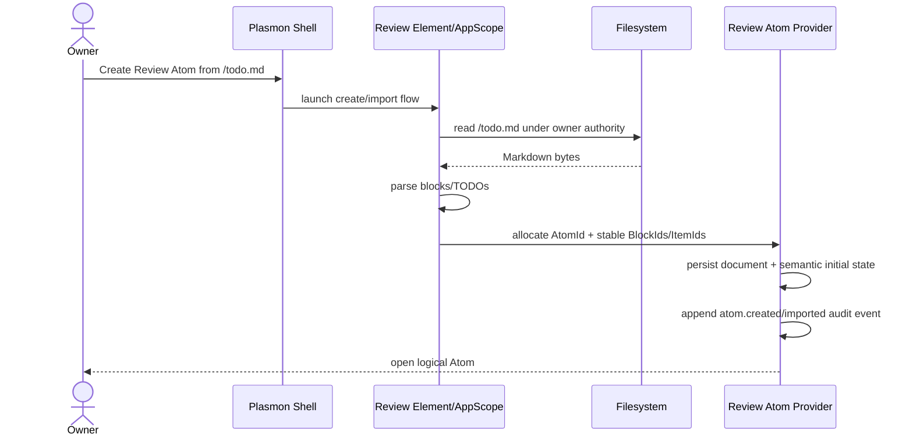
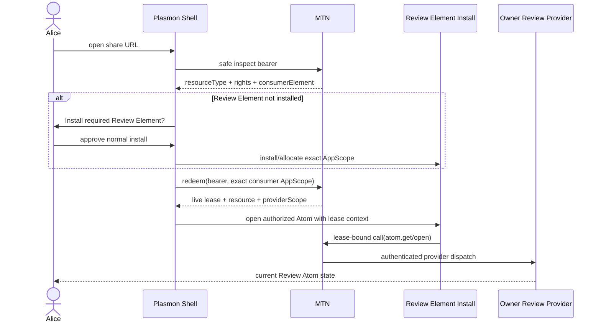
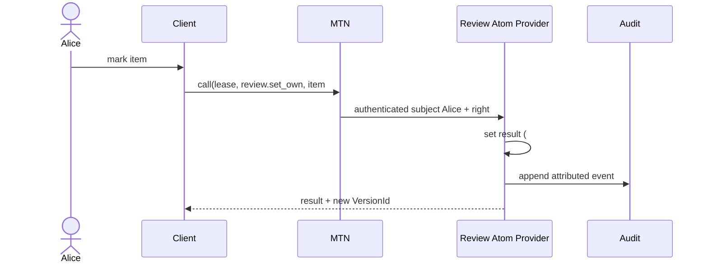
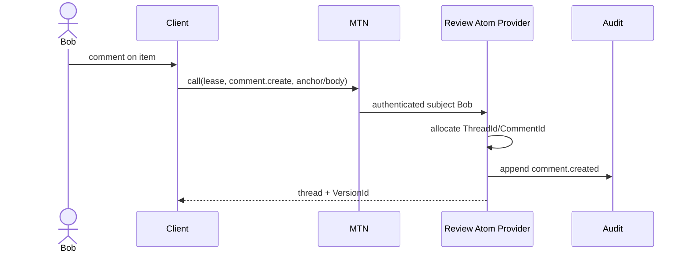
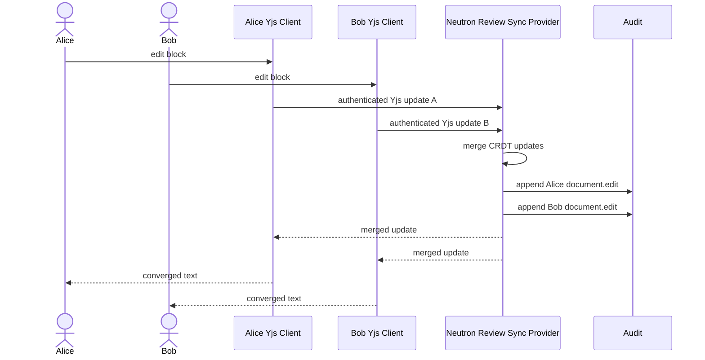
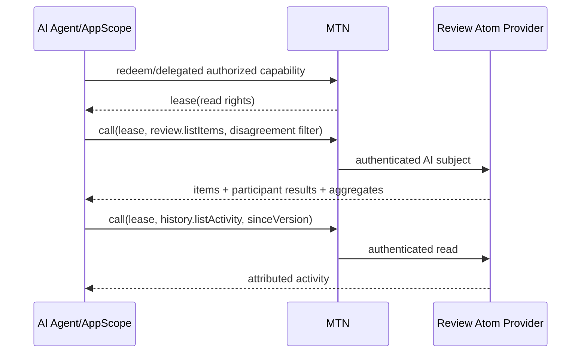
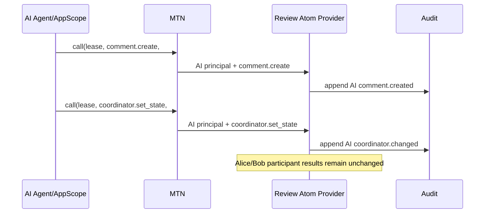
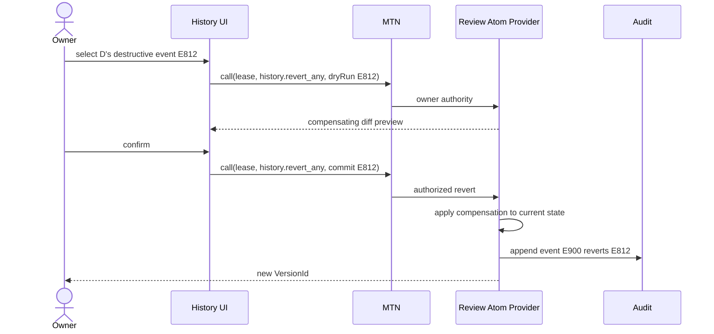
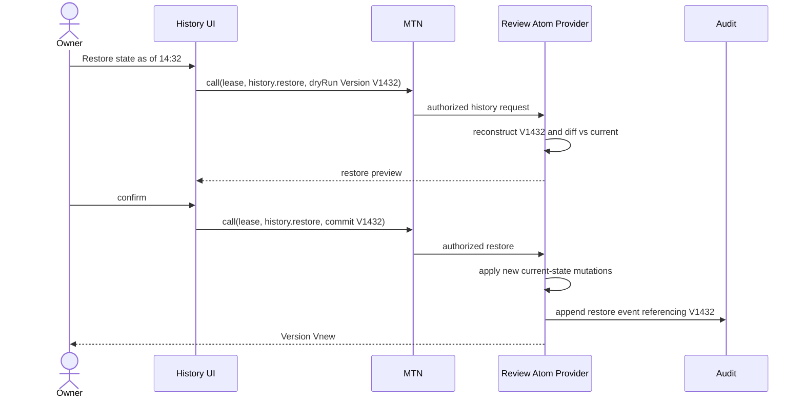
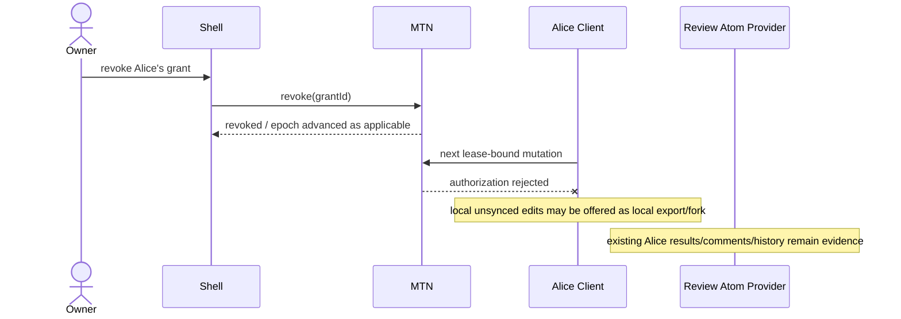

# First Collaborative Plasmon Atom Design

Status: **DESIGN / RESEARCH ONLY — implementation blocked pending Coordinator A approval**

Working Element name: **Review**

Repository baseline:

- Plasmon branch: `agent/atom-collab-design`
- starting SHA: `681d52c9b6dd14043ee54bedf7989c372691a821`
- authoritative MTN 0.2 SHA: `13a412f40bc0c3571c43bcfb8f0e2133b35ffc3a`
- Agent 8 reviewed SHA: `43500e09f5b713d85d9d27ec6ee86c638d68110d`
- Agent 9 reviewed SHA: `bfb866a34614a36ad7b0101bc6b773cebb8a8e4b`

This document intentionally makes no production contract or implementation changes. Its purpose is to answer a narrower but foundational question:

> What is a Plasmon Atom, concretely, when humans and AI collaboratively operate on it?

---

## 1. Executive summary

The first real Plasmon Atom should be **one live collaborative review workspace**, not one Markdown file and not one physical Neutron application instance.

For the Review Element, one Atom is the independently named, openable, shareable, revocable, historied unit containing:

- a structured Markdown-like document with stable block identity;
- stable review-item identity;
- each participant's independent test result for each review item;
- a separate coordinator/project state for each item;
- anchored comment threads;
- a persistent attributed audit/event history;
- history checkpoints sufficient for diff/revert/restore;
- optional source-file linkage and Markdown import/export metadata.

The recommended MVP architecture is:

1. **Yjs v13 as the document-concurrency substrate**, using stable application block/item IDs rather than exposing Yjs internal IDs as the public Atom schema.
2. **Typed Atom commands for review results, comments, coordinator state, item administration, and history operations.** Do not let arbitrary CRDT updates mutate authorization-sensitive semantic maps.
3. **A separate append-only, backend-authored audit/event log** for attribution, history, revert, and restore. Stable Yjs v13 is not sufficient as the authoritative audit layer because Yjs does not record who performed a deletion or when it occurred.
4. **Yjs Awareness only for ephemeral presence.** Presence is not history.
5. **MTN 0.2 remains the sole authorization truth.** Every cross-AppScope operation is lease-bound. The Atom provider derives the actor from the authenticated MTN context; the client never gets to assert `actorId` for an authoritative mutation.
6. **Structured Atom state is canonical. Markdown is import/export plus an optional source link.** For the MVP, creating an Atom from `todo.md` imports an Atom-owned working copy. Applying changes back to the source file is an explicit owner action, not live two-way synchronization.
7. **The share URL identifies an authorization opportunity, not a file download.** Before authorization the shell may safely inspect the grant to discover resource type, rights, and required consumer Element. After exact-AppScope redemption, the lease yields the live revision-free authorization resource identity. Physical provider scope and revision/history are not Atom identity.
8. **`Atom == app_instance_id` does not survive this real use case.** One installed Review Element must eventually be able to own multiple independent review Atoms. The Phase 9 equality remains a POC allocation simplification, not a logical Atom contract.

The most important implication for the current MTN/Sharing reconciliation is that its separation of authorization identity from revision and its first-class live lease/provider-call model are correct. However, **snapshot publication/import must not become the universal Sharing model**. A live mutable Atom needs an open/redeem/call path whose provider operation is against the current Atom, with version/revision only when an operation explicitly requests historical state.

---

## 2. Concrete definition: what exactly is one Atom?

For the Review Element:

> **One Atom is one collaborative review workspace that can be created, opened, shared, authorized, revoked, audited, exported, archived, and restored independently of every other review workspace.**

Examples of two separate Atoms owned by the same person:

```text
Review Element installation
  ├─ Atom 7K...  "Plasmon Gate 3 review"
  └─ Atom BQ...  "Plasmon mobile polish review"
```

They may run through the same physical Review Element installation/AppScope. Sharing one does not authorize the other.

The logical identity is an application-allocated `AtomId`. For MTN authorization, the Review provider can map that stable Atom ID to a revision-free MTN resource reference such as:

```ts
{
  namespace: "plasmon.atom",
  resourceId: atomId,
  resourceType: "plasmon.review/v1",
}
```

The exact namespace string is a future contract decision; the important invariant is:

```text
Atom identity != physical AppScope
Atom identity != window/tile
Atom identity != source path
Atom identity != Markdown bytes
Atom identity != snapshot/version
Atom identity != bearer token/grant
```

A physical installation is **where an Element executes**. An Atom is **the independently addressable application-scoped object on which that Element operates**.

This means the Review Element should be designed as a provider capable of hosting many logical review Atoms inside one installed physical application instance. Creating a second Review Atom should allocate another Atom record, not another Neutron application installation merely to manufacture identity.

---

## 3. Sandstorm/grain lessons

Sandstorm is useful because it forces a porter to make the granularity decision explicitly.

### 3.1 What Sandstorm requires the porter to decide

The Sandstorm handbook calls grain granularity an editorial decision and recommends that a grain normally represent the smallest **unit of sharing** that a user may want to share independently. A spreadsheet app commonly chooses one spreadsheet; a blog app may choose one blog; an image editor may choose one image.

That is the most important idea for Plasmon to borrow:

> The Element/porter must declare what one independently shareable application object is.

Sandstorm's packaging tutorial also asks the package author to provide the noun for a new instance. That seemingly small manifest choice encodes the same architectural decision: document, folder, showcase, blog, spreadsheet, etc.

For Review the answer is **review workspace**, not file and not application installation.

### 3.2 Sharing and permissions

Sandstorm grain URLs route to one grain. Sharing links and API/WebKey tokens are capability grants. Sandstorm handles authentication/authorization and passes the resulting identity/permission context to the app; the app interprets the granted permission bits for its domain behavior.

Plasmon should borrow the separation, not the exact implementation:

```text
Platform/MTN decides and proves granted rights.
Element implements what those rights mean for its Atom schema.
```

For example, MTN can grant `review.set_own`, while Review enforces the semantic invariant that the target participant is the authenticated subject rather than a client-supplied actor ID.

### 3.3 WebKeys and structured APIs

Sandstorm's HTTP API model is important for the AI-agent requirement: an external client can receive a capability to a grain API without screen scraping the application's UI. The platform strips the bearer token before the app and supplies authenticated identity/permission context.

Plasmon should likewise make the Atom's structured API a first-class surface. Humans and AI use different clients over the **same underlying Atom operations and authorization model**.

### 3.4 Powerbox lesson

The Powerbox lets an application request a resource by **type/capability**, then lets the user choose which provider/resource satisfies that request. This is a strong conceptual precedent for a future Plasmon flow in which a compatible Element can open the same Atom/resource without the Atom being permanently bound to one package implementation.

The useful abstraction is:

```text
request protocol/type -> user chooses compatible provider -> capability is granted
```

not:

```text
hard-code another app's physical instance ID
```

### 3.5 Porting existing applications

Sandstorm ports often remove the application's own document picker and make one grain represent exactly one independently shareable object. The package owns its dependencies, while the grain owns writable state. Existing apps can retain an internal user model, but Sandstorm supplies authenticated identity and permissions.

The Plasmon porter equivalent should therefore have to answer at least:

- what one Atom represents;
- how a new Atom is created;
- how an existing external resource is imported/linked;
- what canonical state belongs to the Atom;
- which rights and structured operations it exposes;
- which Atom/resource types it can open;
- how it exports or migrates state.

### 3.6 What not to copy blindly

Sandstorm commonly gives each grain strong process/storage isolation. Plasmon should not infer that every Atom must receive a separate physical Neutron AppScope. The Review use case demonstrates why logical Atom identity must survive independently of physical execution placement.

Sandstorm backup documentation also demonstrates that data can in principle be migrated between app IDs. Plasmon should make that compatibility explicit through Atom type/schema contracts rather than relying on backup surgery.

---

## 4. Open-source collaboration research

### 4.1 Yjs

**Data model:** CRDT shared types including text, arrays, maps, and XML-like structures. Transactions carry an `origin` and generate incremental updates.

**Concurrency:** excellent fit for simultaneous document edits. Updates merge without a central last-write-wins text value.

**Offline:** Yjs is network-agnostic and has an ecosystem of persistence/sync providers. The Review package should not adopt an external hosted backend; it should implement a Neutron/MTN-aware provider and may use local browser persistence as a cache/queued-offline layer.

**Undo:** unusually strong fit. `Y.UndoManager` is selective, scopes to shared types, and can track transaction origins. That directly supports "undo my edits, not Alice's edits."

**Anchors/comments:** `Y.RelativePosition` is explicitly designed to remain attached as remote edits shift ordinary numeric indexes. It is suitable for cursor/range anchors.

**Presence:** the Awareness protocol is explicitly ephemeral collaboration metadata and cleanly matches the desired presence/history boundary.

**History/audit:** this is the major caveat. In stable Yjs internals, deletions do not store who deleted content or when. Snapshots can identify old materialized states but are not a complete authenticated audit log, and upstream explicitly does not recommend using snapshots as a naive restore mechanism. Yjs v14 work on `IdMap`/attribution is promising for Google-Docs-like attribution, but current v14 packages are release candidates and the stable `y-websocket` documentation still recommends Yjs v13 for most users.

**Browser/runtime cost:** strong. The stable line is pure JavaScript and modular; there is no required WASM runtime. A custom provider can keep network and persistence inside Neutron.

**License:** MIT.

**Conclusion:** best MVP concurrency substrate, but not the Atom history/security system.

### 4.2 Automerge

**Data model:** JSON-like CRDT document. A document is described as a unit of change similar to a JSON object plus a Git repository. Changes form a causal graph identified by hashes; heads identify historical points.

**Concurrency/offline:** excellent. It is explicitly local-first, supports disconnected edits, and automatically merges concurrent changes.

**History:** stronger intrinsic historical model than stable Yjs. Heads/change hashes, differences, forks, and historical reads are first-class. Lower-level changes have CRDT actor identifiers/dependencies and change metadata. However, a CRDT actor identifier is not an authenticated Plasmon principal and therefore does not remove the need for an MTN-bound application audit layer.

**Conflicts:** concurrent text/list edits are merged; concurrent writes to the same map property have a deterministic winner while conflicts remain inspectable. Participant review state should not be modeled as multiple people writing the same property anyway; it should be keyed by participant.

**Rich text/anchors:** rich-text marks and block markers are supported. Cursor/range APIs are improving, but the documented Yjs RelativePosition path is more directly mature for this MVP's annotation need.

**Undo:** the reviewed Automerge documentation exposes rich history/fork/diff primitives but no direct equivalent of Yjs's documented scoped `UndoManager` with `trackedOrigins`. Selective per-user undo would therefore still be application work.

**Browser/runtime cost:** the current implementation uses a Rust core compiled to WASM for JavaScript. Automerge 3 reports major memory reductions, but it remains a heavier substrate than a pure-JS Yjs core for a small `.neutron` proof application.

**License:** MIT.

**Conclusion:** credible alternative, especially if intrinsic history becomes the dominant concern. For the hackathon MVP, Yjs's per-origin undo, relative anchors, presence ecosystem, and lighter browser integration outweigh Automerge's stronger native change graph because Plasmon still needs a separate authenticated event layer either way.

### 4.3 HedgeDoc

HedgeDoc is a mature reference for the **product experience** of real-time collaborative Markdown. The current project is split between stable-maintenance 1.x and a 2.x rewrite; its repository is AGPLv3. More importantly for this Atom, anchored floating comment threads remain an open feature request rather than a mature primitive to reuse.

Borrow:

- Markdown collaboration UX expectations;
- share/open document mental model;
- import/export ergonomics.

Do not embed/fork it as the Atom engine. Doing so imports a full application/backend and does not solve participant-specific review state, MTN authorization, Atom audit, or AI capability surfaces.

### 4.4 Etherpad

Etherpad is useful as a history/audit reference. Its pad database stores a head revision and per-revision changesets with author and timestamp; its timeslider exposes historical revisions. Recent Etherpad releases continue to enforce authorship invariants around inserted operations.

Borrow:

- every accepted edit should become a durable attributed revision/event;
- historical playback/diff should be a first-class product surface;
- "restore revision" should itself become a new attributed operation.

Do not adopt Etherpad's entire OT/server architecture. Review needs structured semantic objects beyond attributed text, and Plasmon already needs a Neutron/MTN-native provider.

License: Apache-2.0.

### 4.5 BlockSuite / AFFiNE

BlockSuite is a useful structural reference because it builds a collaborative document store on Yjs, gives blocks stable application structure, and separates persistence/format transformers from editor UI. It also advertises document time-travel. AFFiNE demonstrates the same local-first collaborative direction at full-product scale.

Borrow:

- application-level block identity on top of CRDT internals;
- block snapshot/transformer boundary for Markdown import/export;
- headless document model separated from rendering.

Do not adopt the whole stack for the first Atom. BlockSuite is a substantial editor framework, is MPL-2.0, and solves a far broader problem than a review/TODO proof.

### 4.6 Research comparison

| Candidate | Concurrency | Offline/local-first | Per-user undo | Stable annotation primitive | Native history | Authenticated attribution | Browser fit | License | Review Atom fit |
|---|---|---|---|---|---|---|---|---|---|
| Yjs v13 | CRDT | strong/provider-dependent | **documented selective UndoManager** | **RelativePosition** | snapshots/updates, incomplete attribution | app layer required | **excellent, pure JS** | MIT | **recommended** |
| Automerge 3 | CRDT | **excellent** | app-level work | improving rich text/cursor model | **excellent change graph** | app layer required | good, WASM core | MIT | strong alternative |
| HedgeDoc | app-specific | server-oriented | editor behavior | comments not mature upstream | app history dependent | app-specific | full app | AGPLv3 | UX reference only |
| Etherpad | OT/changesets | server-oriented | editor undo | not the key strength | **per-revision author/timestamp** | identity integration required | full server app | Apache-2.0 | history UX reference |
| BlockSuite | Yjs-based | strong | inherited/custom | block model | time-travel model | app layer required | large editor framework | MPL-2.0 | structural reference |
| AFFiNE | Yjs/y-octo ecosystem | strong | product-specific | product-specific | product-specific | product-specific | very large product | mixed/CE MIT | architecture reference |

No candidate by itself satisfies Plasmon's requirements. The missing piece in all of them is **MTN-authenticated semantic attribution and authorization-aware revert/restore**.

---

## 5. Recommended collaboration stack

### 5.1 Split the problem into three state planes

Do not put every feature into one CRDT document.

```text
Plane A — collaborative document content
  Yjs v13
  stable BlockId application schema
  per-block collaborative text
  block ordering

Plane B — semantic Review Atom state
  typed provider commands
  review items
  per-participant results
  coordinator state
  comments/threads
  source linkage

Plane C — authoritative history/audit
  append-only backend events
  checkpoints/materialized versions
  actor derived from MTN authorization context
```

Presence is a fourth, explicitly ephemeral plane via Yjs Awareness.

### 5.2 Why semantic state should not be arbitrary client CRDT updates

A reviewer may have `review.set_own` but not `review.set_any`. If review results live in an arbitrary client-writable `Y.Map`, a malicious client could craft a CRDT update that writes Alice's entry.

Therefore protected semantic mutations must be typed operations such as:

```text
setMyReviewResult(itemId, status)
addComment(anchor, body)
setCoordinatorState(itemId, state)
createReviewItem(...)
resolveThread(threadId)
```

The provider derives the authoritative actor from the MTN lease/call context and validates the operation against the granted right. The client does not submit an authoritative `actorId`.

Document editing is different: a holder of `document.edit` may submit document CRDT changes, but the provider still authenticates the call, applies it to a controlled document, derives/logs the resulting change, and never accepts audit records supplied by the browser.

### 5.3 Transport

Use the Yjs synchronization protocol or equivalent incremental update encoding behind a **Neutron-native provider**, not a public third-party collaboration service.

A conventional `y-websocket` server is a useful protocol/reference implementation, but the production `.neutron` application should route authoritative collaboration through its own provider/backend so that:

- authorization is MTN lease-bound;
- Atom persistence stays with the Atom provider;
- accepted edits can be attributed before becoming canonical;
- revocation can stop future accepted updates;
- no additional cloud backend becomes authorization truth.

Long-lived WebSocket/session optimization must not turn an old authorization decision into permanent authority. A connection may cache a live session, but protected provider operations must continue to honor MTN lease/revocation semantics.

---

## 6. Rejected alternatives

### 6.1 One shared Markdown checkbox

Rejected. It destroys individual evidence and creates last-writer-wins semantics where A/B/C should coexist.

### 6.2 Markdown as the complete canonical database

Rejected. Ordinary Markdown cannot faithfully represent participant-specific state, threaded comments, authorization, coordinator state, audit history, or restore metadata without turning the document into an application-specific database disguised as text.

### 6.3 One giant client-writable CRDT object

Rejected for authorization-sensitive semantic state. CRDT convergence is not an authorization mechanism.

### 6.4 Automerge as the sole history/audit system

Rejected for the MVP. Automerge's native change graph is strong, but CRDT actor IDs are not MTN principals, and provider authorization/revert policy still requires an application event layer. Its additional history strength therefore does not eliminate the hardest Plasmon-specific work.

### 6.5 HedgeDoc/Etherpad/AFFiNE as embedded application backends

Rejected. They are useful references, but each imports a separate full-stack persistence/auth/product model that conflicts with the goal of proving a Neutron/MTN-native Atom.

### 6.6 Atom equals source file

Rejected. The review workspace contains much more state than a `.md` file and must remain shareable/history-addressable if the source file is renamed, edited, or deleted.

### 6.7 Atom equals physical app instance

Rejected as a long-term abstraction. One installed Review Element should host multiple independent review workspaces. Physical placement is runtime detail.

---

## 7. Canonical data model

The following is schema design, not production TypeScript.

```ts
type AtomId = string;
type BlockId = string;       // application-generated UUIDv7/ULID-like stable ID
type ReviewItemId = string;  // separate stable semantic ID
type ThreadId = string;
type CommentId = string;
type EventId = string;
type VersionId = string;
type PrincipalId = string;

type ActorType = "human" | "ai" | "system";

type ReviewStatus =
  | "not_tested"
  | "working"
  | "not_working"
  | "needs_polish"
  | "blocked";

type CoordinatorState =
  | "untriaged"
  | "needs_investigation"
  | "pending_fix"
  | "fixed_needs_retest"
  | "resolved"
  | "deferred";

interface AtomMetadata {
  atomId: AtomId;
  atomType: "plasmon.review/v1";
  schemaVersion: 1;
  title: string;
  createdAtNs: string;
  createdBy: PrincipalId;
  archivedAtNs?: string;
  authorizationResource: {
    namespace: string;
    resourceId: string;       // stable, revision-free
    resourceType: string;
  };
}

interface KnownActor {
  principal: PrincipalId;
  actorType: ActorType;
  displayNameSnapshot: string;
  firstSeenAtNs: string;
  lastSeenAtNs?: string;
}

interface DocumentBlock {
  blockId: BlockId;
  kind: "paragraph" | "heading" | "list_item" | "code" | "quote" | "other";
  // Collaborative textual content lives in the Yjs document.
  archived?: boolean;
}

interface ReviewItem {
  itemId: ReviewItemId;
  blockId?: BlockId;
  title: string;
  createdAtNs: string;
  createdBy: PrincipalId;
  archivedAtNs?: string;
}

interface ParticipantReviewResult {
  itemId: ReviewItemId;
  participant: PrincipalId;
  status: ReviewStatus;
  note?: string;
  updatedAtNs: string;
  lastEventId: EventId;
  testCycle?: string;
}

interface ItemCoordinatorState {
  itemId: ReviewItemId;
  state: CoordinatorState;
  updatedAtNs: string;
  updatedBy: PrincipalId;
  lastEventId: EventId;
}

type CommentAnchor =
  | { kind: "atom" }
  | { kind: "item"; itemId: ReviewItemId }
  | { kind: "block"; blockId: BlockId }
  | {
      kind: "text_range";
      blockId: BlockId;
      fromRelativePosition: Uint8Array;
      toRelativePosition: Uint8Array;
      createdAtVersion: VersionId;
      quotedContext: string;
    };

interface CommentThread {
  threadId: ThreadId;
  anchor: CommentAnchor;
  createdAtNs: string;
  createdBy: PrincipalId;
  resolvedAtNs?: string;
  resolvedBy?: PrincipalId;
  comments: CommentId[];
}

interface Comment {
  commentId: CommentId;
  threadId: ThreadId;
  author: PrincipalId;
  actorType: ActorType;
  body: string;
  createdAtNs: string;
  editedAtNs?: string;
  deletedAtNs?: string; // tombstone/redaction policy, not history erasure
}

interface SourceLink {
  mode: "imported_copy" | "linked";
  sourceKind: "filesystem" | "resource";
  sourceRef?: string;             // non-secret logical reference; exact future type TBD
  importedAtNs: string;
  importedContentHash: string;
  lastAppliedContentHash?: string;
}

interface VersionPointer {
  versionId: VersionId;
  eventSequence: string;
  documentCheckpointId: string;
  semanticCheckpointId: string;
  createdAtNs: string;
}

interface AuditEvent {
  eventId: EventId;
  atomId: AtomId;
  sequence: string;                // monotonic provider sequence
  actor: {
    principal: PrincipalId;
    actorType: ActorType;
    displayNameSnapshot: string;
  };
  occurredAtNs: string;
  operation: string;
  target: {
    kind: "atom" | "block" | "item" | "result" | "thread" | "comment" | "source";
    id?: string;
  };
  authorization: {
    right: string;
    grantId?: string;              // if safely available/non-secret
    decisionRef?: string;          // never a bearer token
  };
  causality: {
    clientMutationId?: string;
    baseVersion?: VersionId;
    resultingVersion: VersionId;
  };
  before?: unknown;
  after?: unknown;
  reversible?: {
    strategy: "semantic_inverse" | "document_patch" | "restore_checkpoint";
    inverseDataRef?: string;
  };
  revertsEventIds?: EventId[];
  restoresVersionId?: VersionId;
  previousEventHash?: string;
  eventHash?: string;
}
```

### 7.1 Canonicality

There are deliberately several independent truths:

- **Current collaborative document truth:** Atom-owned structured Yjs document state plus persisted updates/checkpoints.
- **Current semantic Review truth:** provider-owned Review records materialized from accepted typed operations.
- **Historical attribution truth:** append-only provider audit events plus checkpoints.
- **Authorization truth:** MTN grants/leases/revocation/epochs, not the Atom database.
- **Presence truth:** none persistently; Awareness is ephemeral.
- **Markdown truth:** projection/import/export, not canonical collaboration metadata.

Do not duplicate MTN's grants or revocation truth into the Atom. The Atom may retain non-secret references/display data for activity presentation, but authorization decisions are always made through MTN.

---

## 8. Stable document and review-item identity

### 8.1 Stable BlockId

Every imported Markdown block receives an application-level stable `BlockId`. The canonical document is a block order plus per-block collaborative content, rather than one unstructured string whose only identities are line offsets.

An inserted line above a block changes neither the block ID nor any item/comment anchored to that block.

### 8.2 Stable ReviewItemId

A review item receives its own immutable `ReviewItemId`, normally linked to the block that describes it.

```text
Block 01HT...  "- [ ] Download works"
   ↳ ReviewItem 01HT...  (stable semantic identity)
```

Changing the text to:

```text
- [ ] Download works from File Manager
```

updates the block text while preserving the review item and all A/B/C evidence.

Deleting the descriptive block does **not** silently erase the review item, results, or comments. It may detach/archive the review item through an explicit semantic operation, preserving history.

### 8.3 Why not CRDT internal IDs as public IDs

Yjs internal IDs are useful implementation detail but should not become the portable Atom API. Public stable IDs should survive a future collaboration-engine migration, import/export transforms, or compatible Element implementation.

### 8.4 Raw Markdown source mode

A completely unrestricted whole-file source editor makes stable structured identity harder because cut/paste can look like deletion plus unrelated insertion. For the hackathon, prefer a Markdown-source-like block editor in which blocks have stable identity and each block's text is collaboratively editable.

A future full-source mode can parse a transactional Markdown projection back into block operations and preserve IDs where mapping is unambiguous. Ambiguous delete/recreate is allowed to create a new semantic identity rather than guessing incorrectly.

---

## 9. Participant-specific review state and consensus

The exact MVP vocabulary is:

```text
not tested
working
not working
needs polish
blocked
```

Each participant owns an independent result slot per review item:

```text
Review item #72: Text editor opens Monaco

Alice   working
Bob     not working
Carol   needs polish
Dave    not tested
```

No participant result overwrites another participant's result.

The canonical key is conceptually:

```text
(itemId, participantPrincipal)
```

A `review.set_own` operation ignores any participant ID supplied by the client and derives the participant from the authenticated actor.

### 9.1 Aggregate is a projection

Aggregate/consensus is computed, never stored as a replacement for evidence.

For each item compute at least:

```ts
interface ReviewAggregate {
  working: number;
  notWorking: number;
  needsPolish: number;
  blocked: number;
  notTested: number;
  testedCount: number;     // working + notWorking + needsPolish
  assignedCount?: number;
  workingConsensus: boolean;
}
```

Rules:

```text
testedCount = working + notWorking + needsPolish
workingConsensus = testedCount > 0 && working == testedCount
```

A blocked participant is separately visible because they could not complete the test. `not_tested` is also visible and excluded from the tested denominator.

Therefore the UI can truthfully say:

```text
3 / 3 tested participants say WORKING
1 participant is BLOCKED
1 participant has NOT TESTED
```

It must not abbreviate that to "everyone agrees" when assigned reviewers remain blocked/untested.

### 9.2 Test cycles

The dog-food loop needs retesting after a fix. Post-MVP, results should support test-cycle IDs so an old "broken" report remains historical while a new cycle asks for fresh evidence. For the MVP, the coordinator can set `fixed_needs_retest`, and changing a participant result creates history rather than deleting the prior result event.

---

## 10. Coordinator/project state is a separate dimension

Participant evidence and project workflow are not the same field.

Example:

```text
Alice result:        NOT WORKING
Bob result:          NOT WORKING
AI coordinator:      PENDING FIX
```

The recommended coordinator vocabulary is:

```text
untriaged
needs investigation
pending fix
fixed / needs retest
resolved
deferred
```

An AI agent or maintainer with `coordinator.set_state` can change this field without modifying Alice or Bob's results.

This separation is mandatory for the intended loop:

```text
human evidence -> triage -> fix -> needs retest -> new human evidence
```

---

## 11. Comments and anchors

### 11.1 Thread model

Comments are durable threads with replies, author identity, timestamps, resolve/reopen history, and a stable thread ID.

MVP anchors:

- Atom/document;
- review item;
- Markdown block;
- text range inside one block.

### 11.2 Range anchors

For a range comment, store Yjs encoded `RelativePosition` endpoints plus:

- stable `BlockId`;
- creation `VersionId`;
- short quoted context for human recovery.

This means inserting lines or characters before the range does not immediately orphan it.

If the underlying CRDT content is actually deleted such that the relative position can no longer resolve, mark the thread **detached** rather than deleting it. The history view can still render the creation-version context and the owner can re-anchor it.

### 11.3 Resolve/reopen

Resolve and reopen are semantic mutations and therefore audit events. Resolution never removes the thread.

### 11.4 Comment edit/delete

Comment edits should retain edit history. A normal delete should become a tombstone/soft delete where policy permits. Administrative redaction is a distinct operation and must itself be auditable.

---

## 12. Concurrent Markdown editing

### 12.1 Document representation

Use a Yjs document for:

```text
block order
block existence/tombstone markers as appropriate
per-block collaborative text
```

Application-level `BlockId`s are the stable schema. Yjs resolves concurrent edits inside and among the document structures.

### 12.2 Two users typing

Alice and Bob edit against local replicas. Their edits are emitted as Yjs updates. The Neutron provider accepts updates only from a session authorized for `document.edit`, applies them to the canonical Atom document, records an attributed document-edit event, and propagates resulting updates.

No client writes a whole Markdown string with last-write-wins semantics.

### 12.3 Disconnect/reconnect

Yjs permits local disconnected edits. For Plasmon, disconnected changes are **provisional until re-authorized and accepted** by the provider after reconnect.

If a participant is revoked while offline:

- their local replica may still contain unsynchronized work;
- reconnect must not let stale authority publish it;
- the server rejects the mutation because the current MTN authorization is no longer valid;
- the UI may offer a local export/fork so work is not invisibly destroyed.

This keeps offline capability from becoming permanent authority.

### 12.4 Why not peer-to-peer WebRTC for the MVP

A direct peer mesh complicates authoritative attribution, revocation, persistence, and owner rollback. The MVP should use a provider-centered synchronization topology even though Yjs itself is network-agnostic.

---

## 13. Per-user undo

There are two undo classes.

### 13.1 Document typing undo

Each editor client uses a `Y.UndoManager` scoped to the document types and configured with a unique transaction origin for that user/session.

```text
Alice Ctrl+Z -> reverts Alice's latest tracked document transaction
Bob's remote transaction -> not on Alice's undo stack
```

The undo becomes a new shared CRDT mutation and a new audit event. It does not secretly alter only Alice's local view.

### 13.2 Semantic undo

Review statuses/comments/coordinator state use application-level undo/revert:

```text
undo my last status change
undo my last comment edit
```

The provider finds the latest reversible event owned by that actor, verifies the current `history.revert_own` right and applicability, then writes a compensating event.

### 13.3 Limits

Undo is not a time machine. If later edits make an inverse ambiguous, the UI should offer a preview/conflict rather than blindly overwrite another participant's newer work.

---

## 14. History and authoritative audit model

### 14.1 Why Yjs history alone is insufficient

Stable Yjs intentionally does not record deletion actor/time in its struct store. A Yjs client ID is also not an authenticated Plasmon principal. Therefore Yjs updates/snapshots cannot satisfy:

```text
Who did this?
Was the actor authorized at acceptance time?
Which semantic operation occurred?
Can I revert only D's destructive operation?
```

### 14.2 Backend-authored events

Every meaningful accepted mutation gets one or more server/provider-authored `AuditEvent`s.

At minimum record:

- stable event ID;
- monotonic Atom event sequence;
- Atom ID;
- authenticated principal;
- actor type snapshot (`human | ai | system`);
- timestamp from the authoritative provider/runtime;
- operation;
- stable target identity;
- right used;
- base/resulting version information;
- before/after semantic data or reversible change reference;
- client mutation ID for idempotency;
- optional compensating-event references;
- optional hash chaining for tamper evidence.

Never persist bearer tokens in this log.

### 14.3 Actor identity

The browser may suggest display metadata, but authoritative actor principal comes from the MTN-authorized provider call/session. An AI's actor type is registered metadata about that principal/integration, not a client-controlled flag.

### 14.4 Version pointers and checkpoints

A historical version is not Atom identity. Define a `VersionId` that points to:

```text
AtomId
+ event sequence watermark
+ document checkpoint/update position
+ semantic checkpoint position
```

Periodically persist checkpoints so historical reconstruction does not require replay from event zero. Checkpoints are acceleration/materialization artifacts; the event log remains evidence of how the Atom changed.

### 14.5 What "everything everyone clicked" means

Do not silently reinterpret this requirement. Split it into three classes:

1. **Authoritative mutation audit — persistent by default.** Status changes, edits, comments, resolves, item creation, coordinator state, share/revoke administration, revert, restore, export/apply-back.
2. **Access/activity events — optional persistent activity.** Open Atom, join collaboration, reconnect, begin AI processing. Useful for "who participated" but not required to reconstruct state.
3. **UI interaction telemetry — optional, separate, retention-limited.** Clicking a collapsed section, navigating to item #72, toggling a filter, etc. These do not belong in the authoritative state history and are not rollback inputs.

Security/privacy consequence: the owner may enable interaction telemetry for a dog-food review, but it must be visibly separate from audit history and should have an explicit retention policy. Presence events are not automatically persisted as telemetry.

---

## 15. Change-level revert and point-in-time restore

### 15.1 Revert one destructive change

`revert(eventId)` is an authorized semantic operation.

Flow:

1. load the target event and its before/after/reversible data;
2. confirm actor has `history.revert_any` (or `history.revert_own` for own event);
3. compute a compensating mutation against the **current** state;
4. detect collisions with later dependent edits;
5. preview or require manual resolution if inverse is ambiguous;
6. apply the compensation as new current state;
7. append a new audit event referencing `revertsEventIds`.

History remains:

```text
14:31 D deleted block #27
14:36 Brian reverted event E-812
```

The original event is never erased.

### 15.2 Revert a destructive participant's batch

The history UI can filter by actor/time/target, select D's destructive events, derive a dependency-aware reverse plan, preview it, then commit one administrative revert batch. Each affected object remains traceable to the original and compensating events.

### 15.3 Restore to 14:32

Point-in-time restore means **make the current Atom match historical version V as a new mutation**, not move the history pointer backward.

Flow:

1. reconstruct target state from checkpoint + events;
2. diff target vs current structured document and semantic state;
3. preview the restore impact;
4. apply new CRDT/semantic operations that make current state match target;
5. append a `restore` event with `restoresVersionId = V`;
6. create a new resulting version after the restore.

The Atom's identity and old history remain unchanged.

### 15.4 Document restore implementation constraint

Do not replace the live Yjs document with an unrelated fresh document in a way that destroys object identity. Restore should generate current-state operations against stable `BlockId`s where possible. Blocks present historically but currently absent can be restored with their application IDs; text is transformed by explicit edits. Ambiguous cases receive a restore preview.

---

## 16. Presence model

Presence is ephemeral and uses Yjs Awareness or an equivalent transient channel.

Example:

```ts
interface PresenceState {
  principal: string;
  displayName: string;
  actorType: "human" | "ai";
  activeItemId?: ReviewItemId;
  activeBlockId?: BlockId;
  editing?: boolean;
  activity?: "viewing" | "editing" | "processing";
}
```

Examples:

```text
Alice is viewing item #27
Bob is editing block #4
Carol is online
AI Agent is processing results
```

Rules:

- no rollback derives from presence;
- presence is not authoritative proof an action occurred;
- normal disconnect removes presence;
- persistent activity logging, if enabled, is a separate event stream.

---

## 17. Permission model

Use composable rights; roles are only convenient grant templates.

### 17.1 Proposed rights vocabulary

```text
atom.read
atom.export

document.edit

review.set_own
review.set_any
review.item.create
review.item.archive

comment.create
comment.edit_own
comment.resolve
comment.moderate

coordinator.set_state

history.read
history.diff
history.revert_own
history.revert_any
history.restore

share.issue
share.delegate
share.revoke
permissions.admin
```

Exact strings can be revised when the Atom contract is frozen; the important part is the decomposition.

### 17.2 Role templates

| Template | Typical rights |
|---|---|
| Owner | all rights |
| Coordinator/Maintainer | read/edit, item/comment, coordinator, history read/revert, selected share rights |
| Reviewer/Tester | read, optionally document edit, `review.set_own`, comment create/edit-own, history read |
| Commenter | read + comment create/edit-own |
| Viewer | read only |
| AI collaborator | **not a fixed role**; compose only the rights required for that agent task |

### 17.3 Own-result invariant

MTN tells the provider that the caller has `review.set_own`. Review then enforces:

```text
target participant = authenticated MTN subject
```

This is application semantics, not duplicate authorization state.

### 17.4 What MTN does and does not need to express

MTN 0.2 already provides resource identity, rights, audience, grants, leases, revocation, delegation, authorization epochs, and exact-AppScope authenticated calls. Review does not need MTN to understand checklist rows.

The Atom provider is allowed to enforce domain invariants such as "set own result only" while MTN remains the authority that says whether the actor possesses the right at all.

---

## 18. Shared URL lifecycle

### 18.1 The URL is not an Atom file URL

Conceptually:

```text
owner shares Atom
  -> MTN grant/capability
  -> Plasmon share URL
  -> recipient opens URL
  -> safe grant inspection
  -> resolve/install compatible Element
  -> exact consumer AppScope redemption
  -> live lease
  -> lease-bound Atom provider calls
```

The URL must not encode physical provider AppScope as Atom identity. It must not encode a revision as Atom identity.

### 18.2 Pre-authorization information

The current reconciliation correctly limits safe public inspection. Before redemption, Plasmon may know things such as:

- resource type/namespace;
- rights offered;
- consumer Element requirement;
- expiry/revoked status.

It should not require leaking protected `resourceId`, provider scope, issuer scope, or bearer material to select the UI.

### 18.3 After redemption

Redemption occurs with the recipient's **exact current consumer AppScope**. The returned live lease supplies the revision-free authorization resource and provider scope needed for authorized calls.

For a live Review Atom, no snapshot revision is needed to open current state. Historical operations can explicitly take a `VersionId` in the provider operation payload.

### 18.4 Bearer handling

This design intentionally does not freeze whether the bearer appears in URL path, fragment, or another shell-owned encoding. The requirement is:

```text
bearer/capability != AtomId
bearer/capability != revision
bearer is transient authority material
```

The Atom document never stores it.

### 18.5 Recipient lacks the Element

For the MVP, safe inspection identifies the required Review Element before redemption. If no compatible installation/AppScope exists:

1. Plasmon shows the required Element and asks the user to install it through the normal Neutron install flow;
2. after installation/allocation creates an exact consumer AppScope, Plasmon resumes redemption;
3. the Review Element opens the authorized Atom.

Do not implement alternate compatible Elements or owner-hosted compute in the first MVP.

### 18.6 Future compatible Element path

Atom type must be independent of Element ID:

```text
Atom type: plasmon.review/v1
Element A declares: opens plasmon.review/v1
Element B declares: opens plasmon.review/v1
```

A future Powerbox-like chooser can select among compatible Elements. MTN grants authority to the Atom resource; the chosen consumer gets an exact AppScope lease. This is the path to opening the same logical resource through another compatible Element without changing Atom identity.

---

## 19. AI agent as first-class collaborator

### 19.1 No DOM automation as canonical interface

The Review Element exposes a structured Atom API. The human UI is one client; an AI integration is another client.

The agent should normally use semantic operations rather than raw CRDT updates.

### 19.2 Minimum agent API

Read/query:

```text
atom.getMetadata
review.listItems
review.getItem
review.listParticipantResults
review.getAggregate
review.findDisagreements
review.findConsensus
comment.listThreads
comment.getThread
history.listActivity
history.getEvent
history.diff
history.getVersion
```

Mutate, rights permitting:

```text
review.setMyResult
review.createItem
coordinator.setState
comment.add
comment.reply
comment.resolve
comment.reopen
history.revertEvent
history.restoreVersion
```

Optional document operations:

```text
document.getBlocks
document.getBlock
document.patchBlock
```

For bulk analysis, APIs should support filtering and cursors:

```text
list items changed since VersionId
list items with disagreement
list items where all tested results are not_working
list comments unresolved since time/version
```

### 19.3 Authentication and rights

An AI agent participates as an authenticated principal/integration with a normal MTN grant. The grant can be issued directly to a principal or delegated according to MTN policy and constrained by rights, expiry, consumer Element, and redemption rules.

The AI's execution has an exact consumer AppScope. Redemption yields a lease. Every provider mutation uses the lease-bound call path.

### 19.4 AI actor identity

The provider records:

```text
principal: <authenticated subject>
actorType: ai
integration/display snapshot: <registered metadata>
```

The AI cannot label itself as Alice by passing `actorId: "alice"`.

### 19.5 AI activity example

```text
15:42 Brian       set #72 NOT WORKING
15:43 Alice       added comment to #72
15:45 AI Agent    added "Needs investigation: OpenWithServiceModel"
15:51 AI Agent    set coordinator state PENDING FIX
```

The AI's coordinator action never overwrites Alice's participant result.

### 19.6 Dangerous history operations

`history.revertEvent` and `history.restoreVersion` require explicit powerful rights and should support dry-run/preview. A general "AI collaborator" grant should not receive those rights by default.

---

## 20. Source Markdown/import/export model

### 20.1 Evaluated models

**A — Markdown canonical.** Portable, but cannot faithfully encode participant evidence/comments/audit/permissions without invasive metadata. Rejected.

**B — structured collaborative state canonical; Markdown import/export.** Clean semantics and stable IDs. Recommended core model.

**C — hybrid live backing file.** Attractive eventually, but two-way source synchronization creates conflict/rollback problems and allows external filesystem edits to bypass Atom attribution. Defer.

### 20.2 MVP recommendation: Atom-owned working copy

Creation from `/todo.md` means:

```text
read source under owner's authority
  -> parse Markdown blocks
  -> allocate stable BlockIds
  -> allocate ReviewItemIds for imported TODO items
  -> create Atom-owned canonical state
  -> record source hash/link metadata
```

After creation, collaborative changes affect the Atom, not `/todo.md` directly.

Owner actions:

```text
Export Markdown
Apply current Markdown projection back to source
```

`Apply back` is an explicit audited operation that can perform a source-hash conflict check first.

### 20.3 Why this is safer for the first Atom

- destructive collaborators cannot directly corrupt the owner's source file;
- Atom rollback is self-contained;
- external source edits cannot silently bypass audit;
- the Atom remains valid after source rename/delete;
- Markdown remains readable/portable;
- two-way merge can be added later instead of becoming an MVP prerequisite.

### 20.4 Export

Standard Markdown export should intentionally lose non-Markdown collaboration metadata unless the user also exports an Atom archive/sidecar.

Possible exports:

```text
review.md                 # portable Markdown projection
review.atom.json/.archive # structured state + comments/results/history as future portable format
```

Do not stuff A/B/C results or bearer tokens into normal checkbox syntax.

---

## 21. Element / installation / Atom / filesystem / collaboration / MTN boundaries

| Layer | Owns | Must not become |
|---|---|---|
| Element package | code, Atom type declarations, schema/migrations, rights vocabulary, UI/API handlers, import/export | one user's Atom state |
| Physical Neutron installation/AppScope | execution, backend capabilities, provider registration, local persistent provider roots | logical Atom identity |
| Atom | one review workspace's structured current state + logical history references | physical process/window |
| Filesystem | source files and explicit export/apply destinations | collaboration authorization truth |
| Yjs collaboration engine | concurrent document merge, relative anchors, local undo substrate | authenticated audit/permissions |
| Atom provider semantic store | participant results, coordinator state, comments, stable application IDs, source link | MTN grant database |
| Audit/history store | accepted attributed mutations, checkpoints/version pointers | authorization truth or UI telemetry dump |
| MTN 0.2 | AppScope ownership/liveness, grants, bearer capabilities, leases, delegation, revocation, authorization epochs, authenticated cross-AppScope calls | collaboration history |
| Client ephemeral state | selection, filters, draft UI state, local undo stack, presence | canonical Atom state |

### 21.1 Lifecycle

```text
Install Element
  physical Review installation exists

Create Atom
  allocate logical AtomId in Review provider
  optionally import todo.md

Open Atom
  resolve Atom to provider/current state

Share Atom
  issue MTN grant for revision-free Atom resource

Redeem access
  exact consumer AppScope obtains lease

Join collaboration
  load current state + authorized sync/API surface

Edit/review/comment
  CRDT document edits + typed semantic operations
  backend authors audit events

Disconnect/reconnect
  local provisional changes may queue
  server re-authorizes before acceptance

History/revert/restore
  compensating current mutations, never history erasure

Revoke
  MTN revocation invalidates future authority

Reshare/delegate
  MTN delegation, not Atom-local grant shadowing

Archive/export/delete
  application lifecycle operations; destructive delete policy must preserve required audit/backup semantics
```

---

## 22. Implications for current MTN 0.2 / Sharing reconciliation

The concrete Review Atom validates several parts of `MTN_0_2_CONTRACT_RECONCILIATION.md` and exposes one important generalization.

### 22.1 Validated: authorization resource identity must be revision-free

A live Atom has many historical versions while remaining the same Atom. Encoding revision into `resourceId` would create a new authorization identity every edit and is therefore incorrect.

The proposed split between:

```text
AuthorizationResourceRef
PublishedResourceRef + revision
```

is directionally correct.

### 22.2 Validated: exact AppScope is physical execution context, not Element or Atom

A recipient's Review installation/AppScope is not inferable from Element identity. The current proposal correctly requires exact AppScope from trusted runtime context.

### 22.3 Validated: lease must be first-class

Review needs repeated authorized live operations: read, update result, comment, document sync, history query. "Redeem once and trust a local rights snapshot" would break revocation and MTN's accepted provider-call lifecycle. The proposal's lease-bound call path is required.

### 22.4 Validated: safe inspection should remain safe

The shell can choose/install the Review Element using safe pre-auth information such as resource type/consumer Element without requiring exact protected Atom resource identity before redemption.

### 22.5 New pressure: Sharing cannot be snapshot-only

Agent 9's publication/import provider is useful for snapshot/resource transfer, but a Review Atom is a **live mutable shared resource**.

Plasmon therefore needs, after the reconciliation is frozen, a distinction conceptually like:

```text
snapshot share
  explicit non-secret revision/locator
  import/copy operation

live Atom share
  stable revision-free resource
  open/redeem lease
  repeated lease-bound provider operations
  optional VersionId only for history operations
```

Do not force the live case through `importShare(token, destination)`.

This is a Plasmon Sharing/Atom API requirement, **not a request to change MTN 0.2**. MTN already has the needed stable resource + lease-bound operation model.

### 22.6 Provider operation locator should be operation-specific

The reconciliation correctly says a snapshot revision must travel separately from authorization identity. Generalize that lesson: provider-operation parameters are resource-type-specific.

Examples:

```text
snapshot.import(revision)
review.getCurrent()
review.history.get(versionId)
review.comment.add(itemId, body)
```

A universal mandatory `revision` field on every shared resource would be as incorrect as encoding revision into the resource ID.

### 22.7 `Atom == app_instance_id` is conclusively POC-only

Phase 9's equality is useful to prove installation/allocation, but it cannot define the real Atom abstraction:

```text
one principal + Review Element installation
  -> Review Atom A
  -> Review Atom B
  -> Review Atom C
```

If the platform's allocator intentionally provides at most one physical app instance per `(principal, Element)`, then logical Atom IDs **must** be multiplexed within that installation to support more than one review workspace.

This use case therefore turns the earlier caveat into a concrete requirement:

> Future Atom APIs must carry a logical Atom identity distinct from physical `app_instance_id`/AppScope.

No production contract is changed by this document; Coordinator A should incorporate this into the next Atom contract freeze.

---

## 23. Atom/porter manifest implications

An eventual Atom-aware Element manifest should make the Sandstorm-style granularity decision explicit and expose enough information for shell routing, import/export, compatibility, rights, and agents.

Conceptual schema:

```ts
interface AtomKindDeclaration {
  type: "plasmon.review/v1";
  noun: "review";
  description: string;

  // The porter must say what one Atom is.
  granularity: "one collaborative review workspace";

  create: {
    supported: true;
    importTypes: ["text/markdown"];
  };

  open: {
    atomTypes: ["plasmon.review/v1"];
  };

  export: {
    mimeTypes: ["text/markdown"];
  };

  rights: [
    "atom.read",
    "document.edit",
    "review.set_own",
    "comment.create",
    "coordinator.set_state",
    "history.read"
  ];

  agentApi?: {
    protocol: "plasmon.review.agent/v1";
  };

  capabilities?: {
    requiresAuthorizationProvider: true;
    providesLiveAtomResource: true;
  };
}
```

The eventual manifest needs to declare or reference:

1. Element identity/version/update identity;
2. Atom type(s) created/opened;
3. human noun and one-Atom granularity statement;
4. create/import handlers;
5. canonical schema/version/migrations;
6. persistence roots/lifecycle hooks;
7. MIME/file import/export associations;
8. stable Atom identity allocation behavior;
9. rights vocabulary and optional role templates;
10. provider operations/API protocol version;
11. agent-readable structured API protocol;
12. required/provided capabilities;
13. compatible Atom/resource types it can open;
14. optional source-link semantics;
15. backup/archive/export semantics.

It must **not** declare:

- bearer tokens;
- live leases;
- physical recipient AppScope IDs as Atom IDs;
- snapshot revisions as Atom IDs.

The key porter question becomes:

> What does one independently shareable object of this Element mean, and what protocol/state schema makes that object portable beyond this particular execution instance?

---

## 24. Hackathon MVP boundary

The smallest MVP that genuinely proves the Atom model is:

### Required

1. Review Element installable as `.neutron`.
2. Create a logical Review Atom from a Markdown/TODO file.
3. Atom-owned structured block model with stable `BlockId` and stable `ReviewItemId`.
4. Shared URL backed by MTN grant/redeem/revoke.
5. Multiple authenticated participants.
6. Five participant statuses: not tested / working / not working / needs polish / blocked.
7. Independent per-participant results and computed aggregate/consensus.
8. Separate coordinator state.
9. Item/block/document comment threads; text-range comments if the Yjs RelativePosition integration remains small enough for the hackathon, otherwise immediately after the base comment MVP.
10. Yjs v13 concurrent document editing with provider-centered synchronization.
11. Per-user document undo using transaction origins.
12. Persistent provider-authored mutation audit.
13. Activity/history view with actor, time, operation, target.
14. Owner change-level revert.
15. Owner point-in-time restore through a new compensating mutation.
16. MTN revocation enforced on future live operations.
17. Structured AI API for list/query/comment/coordinator state and explicitly granted mutation operations.
18. AI actions in the same audit log as human actions.
19. Standard Markdown export.
20. Explicit source apply-back action with source-hash conflict check.

### May simplify for MVP

- one Review Element implementation only;
- exact Element required if recipient lacks a compatible Element;
- owner-created share grants, no advanced sharing UI;
- provider-centered live sync, no peer-to-peer transport;
- bounded checkpoint retention suitable for hackathon data volume;
- block-oriented Markdown source UI rather than perfect arbitrary whole-file source editing;
- only owner/coordinator can restore/revert others;
- interaction telemetry disabled by default.

### Explicitly post-MVP

- live bidirectional filesystem synchronization;
- compatible alternative Elements / Powerbox-like chooser;
- owner-compute vs recipient-compute choice;
- rich per-range suggested edits;
- generalized multi-document Atom composition;
- cross-Atom links/dependencies;
- cryptographic signing of every application audit event;
- long-term event compaction/archival policy;
- full Yjs v14 attribution integration after it is stable and evaluated;
- sophisticated offline branch UI;
- arbitrary whole-file Markdown source restructuring with perfect ID preservation;
- mobile/desktop native clients beyond the structured API.

---

## 25. Post-MVP roadmap

### Phase 1 — prove the logical Atom boundary

- multiple logical Review Atoms inside one physical Review installation;
- MTN-backed live sharing;
- human + AI collaboration;
- stable semantic IDs;
- history and rollback.

### Phase 2 — source synchronization

- explicit re-import from changed source;
- three-way diff using last imported/applied source hash;
- conflict UI;
- controlled apply-back;
- optional watched linkage only after audit semantics are clear.

### Phase 3 — portable Atom protocols

- freeze `plasmon.review/v1` resource schema/API;
- declare compatible Element handlers;
- build shell chooser for alternative compatible Element;
- portable Atom archive/export.

### Phase 4 — stronger local-first operation

- IndexedDB/local persistence;
- revoked-offline fork/export UX;
- checkpoint/compaction policy;
- evaluate stable Yjs v14 attribution or Automerge if engine-level history materially reduces complexity.

### Phase 5 — generalized Atom platform

Use the Review lessons to freeze generic Atom lifecycle/manifest/tool contracts without assuming every Atom is a document.

---

## 26. Unresolved questions for Coordinator/user decision

None of these block the design document, but they should be decided before implementation or contract freeze.

### Q1. How generic should the first Atom provider contract be?

Recommendation: freeze the minimum generic lifecycle (`create/open/describe/share/export`) plus a typed provider-operation envelope, while keeping Review-specific commands in the Review protocol. Do not prematurely standardize comments/review items as universal Atom concepts.

### Q2. Should full text-range comments be hackathon-required?

Recommendation: stable item/block comments are required. Range comments should be included if RelativePosition integration is straightforward, but should not delay proof of Atom identity/MTN/audit. The schema must support ranges from day one even if UI lands shortly after.

### Q3. What persistent activity beyond mutations should the owner see?

Recommendation: persist open/join/reconnect only behind an explicit Atom activity setting; keep low-level click telemetry separate and off by default. Mutation audit remains mandatory.

### Q4. How long should raw CRDT updates/checkpoints be retained?

Recommendation: define a bounded operational checkpoint policy separately from immutable semantic audit retention. Do not set `gc:false` forever merely to manufacture history from Yjs.

### Q5. Atom ID allocator format

Recommendation: opaque random stable ID (UUIDv7/ULID-like or platform AtomId) with no path, version, user, Element installation, or revision encoded into it. Exact format belongs in the future generic Atom contract.

No high-value choice discovered in research requires stopping this design mission for clarification. The decisions above can safely remain explicit recommendations pending Coordinator A review.

---

## 27. Explicit answers to the required 25 questions

1. **What exactly is one Atom?** One live independently shareable Review workspace: structured document + review evidence + coordinator state + comments + history/source metadata under one stable logical Atom ID.
2. **Is Markdown the Atom?** No. It is import/export material and may be linked source material. The Atom is the richer application object.
3. **Where does collaborative state live?** Atom provider persistence: Yjs-backed document state plus typed semantic Review state plus an append-only audit/checkpoint store.
4. **What is canonical?** Structured Atom state is canonical for collaboration; append-only events are canonical history evidence; MTN is canonical authorization; Markdown is a projection.
5. **Stable checklist identity?** Application-generated immutable `ReviewItemId`, normally linked to a stable `BlockId`; never line number or current text.
6. **Independent A/B/C states?** One result record per `(itemId, authenticated participant)`.
7. **Consensus without evidence loss?** Derived counts and predicates over participant records; never write consensus back over them.
8. **Comment anchors?** Stable item/block IDs; text ranges use Yjs RelativePositions + version/context fallback.
9. **Concurrent Markdown editing?** Yjs v13 CRDT over stable application blocks/per-block text through a Neutron/MTN-aware provider.
10. **Per-user undo?** Y.UndoManager scoped/tracked by local transaction origin for document edits; semantic own-event undo as a compensating provider operation.
11. **Who did what?** Provider-authored immutable AuditEvents using actor identity derived from MTN-authorized calls.
12. **Revert one destructive user?** Filter/select their reversible events, compute dependency-aware compensating mutations, append new revert events.
13. **Restore point in time?** Reconstruct target version, diff against current, apply a new restore mutation, append a restore event; do not erase later history.
14. **Which engine?** Yjs v13 for document concurrency, anchors, undo, presence; separate Atom audit/history layer because Yjs alone is insufficient.
15. **What to reuse?** Yjs CRDT/UndoManager/RelativePosition/Awareness; Sandstorm unit-of-sharing/capability ideas; Etherpad revision-history UX; BlockSuite stable block/transformer pattern; HedgeDoc Markdown UX. Implement Plasmon-specific semantic state, MTN provider, audit, rollback, and agent API.
16. **Minimum AI API?** List/query items/results/consensus/comments/activity/history/diffs plus rights-gated comment/result/coordinator/item/revert/restore operations.
17. **AI authentication?** Normal MTN principal/integration grant -> exact consumer AppScope -> redeem -> live lease -> lease-bound provider calls.
18. **AI audit distinction?** Same AuditEvent schema, authenticated principal plus registered `actorType: ai`; never client-asserted identity.
19. **Shared URL mapping?** URL carries/locates bearer authorization; safe inspection guides Element selection; redemption yields stable Atom authorization resource and provider scope. Element, physical scope, revision, and Atom identity remain separate.
20. **Recipient lacks Element?** MVP prompts install of the required Review Element, obtains exact AppScope, then resumes redemption/open.
21. **Future compatible Element?** Stable Atom type/protocol independent of Element ID; manifests declare compatible Atom types; future chooser selects a provider/consumer implementation.
22. **MTN/Sharing effect?** Reconciliation is correct on revision-free identity/AppScope/lease-bound calls; Sharing additionally needs a live-resource open/call path rather than forcing every share through snapshot import.
23. **Does this prove `Atom == app_instance_id` is POC-only?** Yes. One physical Review installation must own multiple separately shareable Review Atoms.
24. **What must a porter manifest declare?** Unit/granularity of one Atom, Atom type/schema, create/import/open/export handlers, persistence/migrations, rights, provider/agent APIs, compatible Atom types, and lifecycle/backup semantics.
25. **Hackathon vs later?** Hackathon proves logical Atom identity, MTN live sharing, participant evidence, comments, concurrent edit, audit/rollback, AI API, Markdown import/export. Two-way source sync, alternative Elements, advanced offline, and generalized Atom platform are later.

---

## 28. Sequence diagrams

### 28.1 Create Atom from `todo.md`



### 28.2 Human opens shared URL



### 28.3 Human records test result



### 28.4 Human adds comment



### 28.5 Two humans edit concurrently



### 28.6 AI reads review results



### 28.7 AI adds comment/state



### 28.8 Owner reverts one user's destructive change



### 28.9 Owner restores to historical point



### 28.10 Owner revokes participant



---

## 29. Research sources

Primary sources were preferred.

### Sandstorm

- Developer handbook / grain granularity: https://docs.sandstorm.io/en/latest/developing/handbook/
- Grain URLs: https://docs.sandstorm.io/en/latest/developing/path/
- Authentication/permissions: https://docs.sandstorm.io/en/latest/developing/auth/
- HTTP APIs / API tokens / WebKey-style capabilities: https://docs.sandstorm.io/en/latest/developing/http-apis/
- Powerbox: https://docs.sandstorm.io/en/latest/developing/powerbox/
- Generic packaging tutorial: https://docs.sandstorm.io/en/latest/vagrant-spk/packaging-tutorial/
- Meteor packaging tutorial: https://docs.sandstorm.io/en/latest/vagrant-spk/packaging-tutorial-meteor/
- Raw packaging: https://docs.sandstorm.io/en/latest/developing/raw-packaging-guide/
- Pure-client porting/collaboration caveat: https://docs.sandstorm.io/en/latest/developing/raw-pure-client-apps/
- Backups/migration: https://docs.sandstorm.io/en/latest/administering/backups/

### Yjs

- Documentation: https://docs.yjs.dev/
- Shared types/transactions: https://docs.yjs.dev/getting-started/working-with-shared-types
- UndoManager: https://docs.yjs.dev/api/undo-manager
- RelativePosition: https://docs.yjs.dev/api/relative-positions
- Awareness: https://docs.yjs.dev/getting-started/adding-awareness
- Repository: https://github.com/yjs/yjs
- Stable internals/history limitations: https://github.com/yjs/yjs/blob/main/INTERNALS.md
- Emerging attribution design: https://github.com/yjs/yjs/blob/main/attributing-content.md
- WebSocket provider/stable-version guidance: https://github.com/yjs/y-websocket

### Automerge

- Documentation: https://automerge.org/docs/hello/
- Concepts: https://automerge.org/docs/reference/concepts/
- Conflicts: https://automerge.org/docs/reference/documents/conflicts/
- Rich text: https://automerge.org/docs/reference/documents/rich-text/
- Repository: https://github.com/automerge/automerge
- License: https://github.com/automerge/automerge/blob/main/LICENSE

### HedgeDoc

- Repository/project status/license: https://github.com/hedgedoc/hedgedoc
- Floating comment thread request: https://github.com/hedgedoc/hedgedoc/issues/5450

### Etherpad

- Database/revisions: https://docs.etherpad.org/database.html
- Changesets: https://docs.etherpad.org/api/changeset_library.html
- Server hooks: https://docs.etherpad.org/api/hooks_server-side.html
- Privacy/authorship: https://docs.etherpad.org/privacy.html
- Repository/license: https://github.com/ether/etherpad

### BlockSuite / AFFiNE

- BlockSuite: https://github.com/toeverything/blocksuite
- AFFiNE: https://github.com/toeverything/AFFiNE

### Plasmon / MTN sources inspected

- `apps/plasmon/src/os/integration/MTN_0_2_CONTRACT_RECONCILIATION.md` on starting SHA.
- Agent 8 SHA `43500e09f5b713d85d9d27ec6ee86c638d68110d`, including the documented MTN adapter mismatches.
- Agent 9 SHA `bfb866a34614a36ad7b0101bc6b773cebb8a8e4b`, including Sharing Phase B reconciliation requirements.
- MTN 0.2 accepted SHA `13a412f40bc0c3571c43bcfb8f0e2133b35ffc3a`.

---

## 30. Design conclusion

The Review use case supplies the concrete Atom definition the POC was missing:

> **An Atom is the stable logical identity and application-defined state boundary of one independently shareable object, with authorization and execution placement attached to it but not constituting its identity.**

For Review, that object is a collaborative review workspace. Markdown is one representation of its document content. A Neutron app instance is one possible execution host. MTN grants are authority to operate on it. Versions describe its history. None of those is the Atom itself.

The recommended first implementation should therefore prove **logical multi-Atom state inside an Element installation, live MTN-backed sharing, participant-specific evidence, Yjs document concurrency, provider-authored audit/rollback, and a structured human/AI API** before generalizing the Atom platform further.
